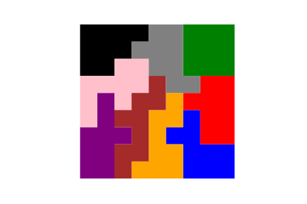

# Irregular "Jigsaw" Sudoku Puzzle Generator
## Generate Sudoku Puzzles in with an extra challenge! 

## What is Irregular Sudoku?
Irregular (a.k.a. Jigsaw, Geometric, or Nonomino) Sudoku is similar to classic Sudoku whereas it consists of a 9x9 grid. However, rather than 9 3x3 blocks within the grid, 
there are instead 9 irregular geometric shapes (consisting of 9 cells each). The same rules as classic Sudoku apply, but you instead solve for the shapes instead of the blocks 
(along with the columns and rows).
